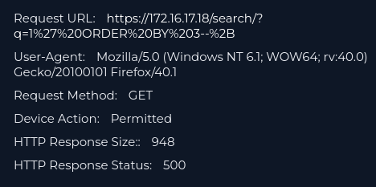

# SOC 165 - Security Triage Report By Juandonado25

# Summary

**EventID** : 115
**Event Time:** Feb, 25, 2022, 11:34 AM
**Rule:** SOC165 - Possible SQL Injection Payload Detected
**Level:** Security Analyst
**Hostname:** WebServer1001
**Destination IP Address:** 172.16.17.18
**Source IP Address:** 167.99.169.17
**HTTP Request Method:** GET
**Requested URL:** hxxps[://]172[.]16[.]17[.]18/search/?q=%22%20OR%201%20%3D%201%20--%20
**User-Agent:** Mozilla/5.0 (Windows NT 6.1; WOW64; rv:40.0) Gecko/20100101 Firefox/40.1
**Alert Trigger Reason:** Requested URL Contains OR 1 = 1
**Device Action:** Allowed

# Actions Taken

- **Context analysis:** Understanding the initial incident summary to decide where to start the research.
- **Log Analysis:** Analyze the endpoint's logs in order to find some IOCs that help me to take a proper decision.
# Findings

### **Multiple URL encoded requests hiding SQL injection attempts:**

**Request URL:** `hxxps[://]172[.]16[.]17[.]18/search/?q=1' ORDER BY 3--+`

![[../images/soc165-log2.png]]
**Request URL:** `hxxps[://]172[.]16[.]17[.]18/search/?q=' OR 'x'='x`

![[../images/soc165-log3.png]]
**Request URL:** `hxxps[://]172[.]16[.]17[.]18/search/?q=' OR '1`

![[soc165-log4.png]]
**Request URL:** `hxxps[://]172[.]16[.]17[.]18/search/?q='`

![[../images/soc165.log5.png]]
**Request URL:** `hxxps[://]172[.]16[.]17[.]18/search/?q=" OR 1 = 1 -- -`

# MITTRE ATT&CK Mapping

- **T1595.002** - Vulnerability Scanning
- **T1190** - Exploit Public-Facing Application

# Decision and Justification

**Decision:** TRUE POSITIVE

**Final Status:** ESCALATED

**Justification:** Log findings indicate that an unsuccessful manual SQL Injection fuzzing was performed, and all five attempts returned error code 500. This requires further investigation because an error code 500 may expose internal database details to the attacker, and this information could be used in future exploitation attempts.

**Recommendation:** Temporarily block source IP address 167.99.169.17 and review the code for the 'q' parameter on the search page.